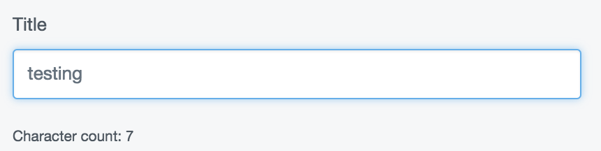
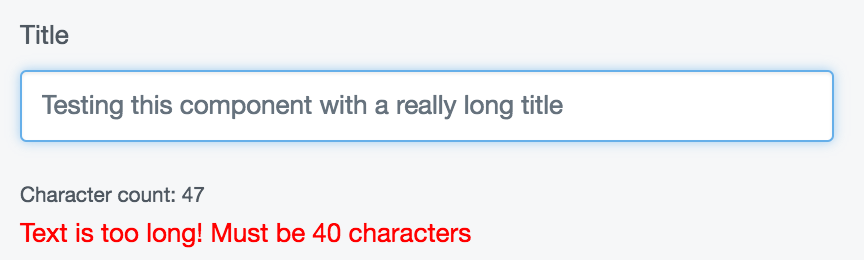
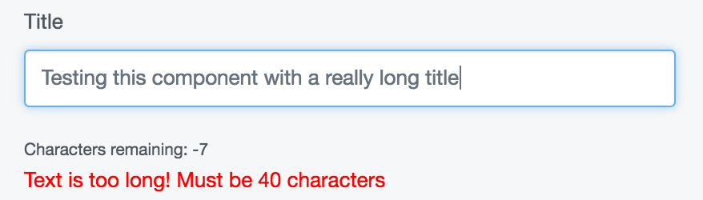

# React components

Some admin modules render their UI with React, a popular Javascript library created by Facebook. 
For these sections, rendering happens via client side scripts that create and inject HTML 
declaratively using data structures. These UI elements are known as "components" and 
represent the fundamental building block of a React-rendered interface.

For example, a component expressed like this:
```js
<PhotoItem size={200} caption={'Angkor Wat'} onSelect={openLightbox}>
	
</PhotoItem>
```

Might actually render HTML that looks like this:
```html
<div class="photo-item">
	<div class="photo" style="width:200px;height:200px;">
		
	</div>
	<div class="photo-caption">
		<h3><a>Angkor Wat/a></h3>
	</div> 
</div>
```

This syntax is known as JSX. It is transpiled at build time into native Javascript calls
to the React API. While optional, it is recommended to express components this way.

This documentation will stop short of explaining React in-depth, as there is much better
documentation available all over the web. We recommend:
* [Tutorial 1])(http://placeholder.com)
* [Tutorial 2])(http://placeholder.com)

## Customising React components

React components can be customised in a similar way to PHP classes, using a dependency
injection API. The key difference is that components are not overriden the way backend
services are. Rather, new components are composed using [higher order components](https://facebook.github.io/react/docs/higher-order-components.html).
This has the inherent advantage of allowing all thidparty code to have an influence
over the behaviour, state, and UI of a component.

### A simple higher order component

Using our example above, let's create a customised `PhotoItem` that allows a badge,
perhaps indicating that it is new to the gallery.

```js
const enhancePhoto = (PhotoItem) => (props) {
	const badge = props.isNew ? 
	  <div className="badge">New!</div> : 
	  null;

	return (
		<div>
			{badge}
			<PhotoItem {...props} />
		</div>
	);
}

const EnhancedPhotoItem = enhancedPhoto(PhotoItem);

<EnhancedPhotoItem isNew={true} size={300} />
```

Alternatively, this component could be expressed with an ES6 class, rather than a simple
function.

```js
const enhancePhoto = (PhotoItem) => {
	return class EnhancedPhotoItem extends React.Component {
		render() {
			const badge = this.props.isNew ? 
			  <div className="badge">New!</div> : 
			  null;

			return (
				<div>
					{badge}
					<PhotoItem {...this.props} />
				</div>
			);

		}
	}
}
```

When components are stateless, using a simple function in lieu of a class is recommended.

### Using the injector to customise a core component

Let's make a more awesome text field. Because the `TextField` component is fetched 
through the injector, we can override it and augment it with our own functionality.

In this example, we'll add a simple character count below the text field.

First, let's create our higher order component.

```js
import React from 'react';

const CharacterCounter = (TextField) => (props) => {
    return (
        <div>
            <TextField {...props} />
            <small>Character count: {props.value.length}</small>
        </div>
    );
}
```

Now let's add this higher order component to the injector. 

```js
import Injector from 'lib/Injector';

Injector.update(
	{
		name: 'my-module'
	},
	update => {
		update('TextField', CharacterCounter);
	}
);
```

Much like the configuration layer, we need to specify a name for this mutation. This
will help other modules negotiate their priority over the injector in relation to yours.

The second parameter of the `update` argument is a callback which receives an `update()` function
that allows you to mutate the DI container. Remember, this function does not _replace_
the component -- it enhances it with new functionality. For clarity, you might consider
naming this callback something like `wrap()` -- a common semantic used for higher
order components.

Now that the customisation is applied, our text fields look like this:



Let's add another customisation to TextField. If the text goes beyond a specified
length, let's throw a warning in the UI.


```js
const LengthCheker = (TextField) => (props) => {  
  const {limit, value } = props;
  const invalid = limit !== undefined && value.length > limit;

  return (
    <div>
      <TextField {...props} />
      {invalid &&
        <span style={{color: 'red'}}>
          {`Text is too long! Must be ${limit} characters`}
        </span>
      }
    </div>
  );
}
```

We'll apply this one to the injector as well, but let's do it under a different name.
For the purposes of demonstration, let's imagine this customisation comes from another
module.

```js
import Injector from 'lib/Injector';

Injector.update(
	{
		name: 'my-other-module'
	},
	update => {
		update('TextField', LengthChecker);
	}
);
```

Now, both components have applied themselves to the textfield.




#### Getting multiple customisations to work together

Both these enhancements are nice, but what would be even better is if they could
work together collaboratively so that the character count only appeared when the user
input got within a certain range of the limit. In order to do that, we'll need to be
sure that the `LengthChecker` customisation is loaded ahead of the `CharacterCounter` 
customisation. 

First let's update the character counter to show characters _remaining_, which is
much more useful. We'll also update the API to allow a `warningBuffer` prop. This is
the amount of characters the input can be within the `limit` before the warning shows.

```js
import React from 'react';

const CharacterCounter = (TextField) => (props) => {
    const { warningBuffer, limit, value: { length } } = props;
    const remainingChars = limit - length;
    const showWarning = length + warningBuffer >= limit;
    return (
        <div>
            <TextField {...props} />
            {showWarning &&
            	<small>Characters remaining: {remainingChars}</small>
            }
        </div>
    );
}

```

Now, when we apply this customisation, we need to be sure it loads _after_ the length
checker in the middleware chain, as it relies on the prop `limit`. We can do that by specifying priority using `before` and `after`
metadata to the customisation.

```js
import Injector from 'lib/Injector';

Injector.update(
	{
		name: 'my-module',
		after: 'my-other-module'
	},
	update => {
		update('TextField', CharacterCounter);
	}
);
```

Now, both components play together nicely.



## Registering new React components

If you've created a module using React, it's a good idea to afford other developers an 
API to enhance those components. To do that, simply register them with `Injector`.

```js
import Injector from 'lib/Injector';

Injector.register('MyComponent', MyComponent);
```

Now other developers can customise your components with `Injector.update()`.

Note: Overwriting components by calling `register()` multiple times for the same
service name is discouraged, and will throw an error. Should you really need to do this,
you can pass `{ force: true }` as the third argument to the `register()` function.

## Using the injector within your component

If your component has dependencies, you can add the injector via context using the `withInjector`
higher order component.

```js
import React from 'react';
import { withInjector } from 'lib/Injector';

class Gallery extends React.Component {
  render() {
    const GalleryItem = this.context.injector.get('GalleryItem');
    return (
      <div>      
      {this.props.items.map(item => (
        <GalleryItem title={item.title} image={item.image} />
      ))}
      </div>
    );
  }
}

export default withInjector(Gallery);
```

